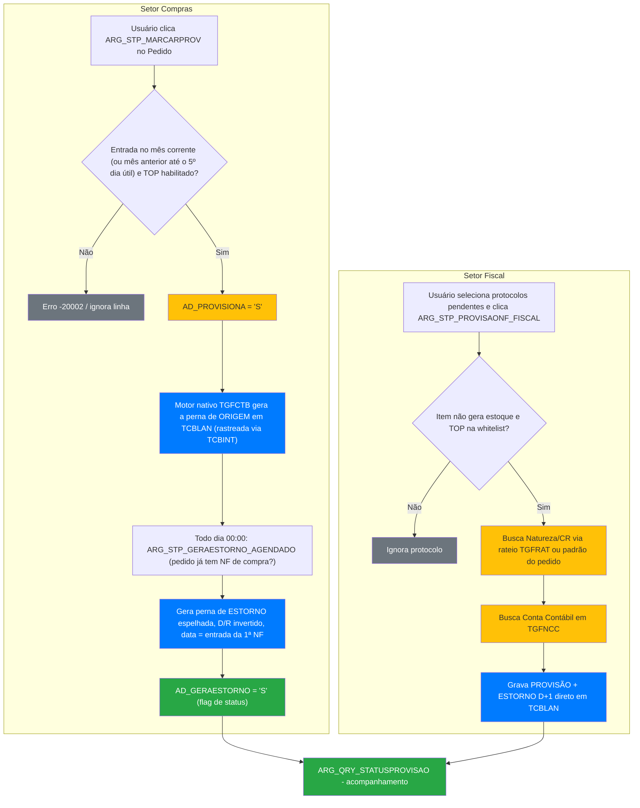

<div align="center">
  
</div>

# 🔄 PROVISAO-MENSAL-NFS — Automação da Provisão Contábil de NFs Pendentes

> Substitui o processo manual (planilhas Excel + lançamento avulso pela contabilidade) de provisionar, no fechamento do mês, notas fiscais de Compras e do setor Fiscal que ainda não foram lançadas — e de estornar automaticamente no mês seguinte.


## Sobre

Todo fim de mês, notas fiscais de Compras e do setor Fiscal que ainda não foram lançadas (mas já representam uma despesa do período) precisavam ser provisionadas manualmente: cada setor exportava uma planilha Excel, filtrava à mão os itens que não geram estoque, e enviava para a contabilidade lançar diretamente na tela de Lançamentos Contábeis — com o estorno sendo feito também manualmente no mês seguinte. Esse processo é lento, depende de passagem de planilha entre pessoas, e já gerou lançamento incorreto por não considerar corretamente o rateio do pedido (caso relatado por RH/Administrativo).

Este projeto substitui a planilha por dois botões de ação dentro do próprio Sankhya — um para o setor de Compras (a partir do Pedido) e um para o setor Fiscal (a partir do Protocolo Fiscal) — mais uma rotina agendada que gera o estorno automaticamente no dia 1 do mês seguinte, sem depender de a contabilidade lançar nada manualmente.

## 📁 Estrutura do Projeto

```
Provisão mensal das NFs/
├── sql/
│   ├── procedures/
│   │   ├── ARG_STP_MARCARPROV.sql            # Botão: marca Pedido de Compra p/ provisão
│   │   ├── ARG_STP_DESMARCARPROV.sql         # Botão: desmarca (se ainda não contabilizado)
│   │   ├── ARG_STP_GERAESTORNO_AGENDADO.sql  # Rotina agendada: gera a perna de estorno
│   │   └── ARG_STP_PROVISAONF_FISCAL.sql     # Botão: provisão do setor Fiscal (via Protocolo)
│   └── queries/
│       ├── ARG_QRY_STATUSPROVISAO.sql        # Consulta de acompanhamento (status por pedido)
│       └── ARG_QRY_PROTOCOLOFISCAL.sql       # Consulta base da grid do Protocolo Fiscal
├── docs/
│   ├── Provisão a partir do Pedido - Setor Compras.docx
│   ├── Provisão a partir do Protocolo - Setor Fiscal.docx
│   ├── Documentacao_Provisao_Pedidos_Compra.docx
│   ├── ESTRUTURA CR x NATUREZA x CONTA CONTÁBIL.xlsx
│   ├── Ata_Reuniao_2026-07-28.md             # Anotações da reunião de kickoff
│   ├── Importador_AD_TCBLANMAN_LEIAME.html   # Doc gerada pelo Sankhya (fluxo legado, ver Observações)
│   └── AD_TCBLANMAN_exemplo.csv              # Exemplo de dado do fluxo legado (não mais usado)
└── README.md
```

## 📚 Referência de Procedures / Queries

| Objeto | Tipo | Setor | Descrição |
|--------|------|-------|-----------|
| `ARG_STP_MARCARPROV` | Botão de ação | Compras | Marca `TGFCAB.AD_PROVISIONA='S'` no Pedido selecionado (`TIPMOV='O'`). Só aceita pedidos em aberto (`PENDENTE='S'`) cuja data de entrada (`DTENTSAI`, ou `DTNEG` se vazia) seja do mês corrente, ou do mês anterior até o 5º dia útil (seg–sex, sem feriados) do mês corrente, e cujo `CODTIPOPER` esteja habilitado na fórmula nativa de `TGFCTB`. |
| `ARG_STP_DESMARCARPROV` | Botão de ação | Compras | Desmarca `AD_PROVISIONA`. Bloqueia se o pedido já tiver lançamento gerado (`TCBINT.ORIGEM='E'`). |
| `ARG_STP_GERAESTORNO_AGENDADO` | Rotina agendada (Proc. Banco de dados) | Compras | Encontra lançamentos de origem (gerados pelo motor nativo via `AD_PROVISIONA`) ainda sem estorno cujo pedido já tem NF de compra vinculada (`TGFVAR`), e grava a perna espelho (D↔R invertido) na data de entrada da 1ª NF. Um pedido com erro não trava os outros. |
| `ARG_QRY_SIMULA_ESTORNO` | Consulta (DBExplorer) | Compras | Simula a próxima execução da rotina de estorno: pedido, valor, competência/data do estorno e se vai falhar por período fechado. |
| `ARG_STP_PROVISAONF_FISCAL` | Botão de ação | Fiscal | A partir dos protocolos selecionados na tela de Protocolo Fiscal, calcula Natureza/Conta (via `TGFNCC`, usando rateio de `TGFRAT` quando existir) e grava **provisão + estorno D+1** direto em `TCBLAN`, já que aqui a origem não existe em nenhum lugar do sistema ainda. |
| `ARG_QRY_STATUSPROVISAO` | Consulta (DBExplorer) | Compras | Mostra, por pedido, se a provisão e o estorno já foram lançados e em que data. **Ver Observações — precisa de ajuste antes de virar dashboard.** |
| `ARG_QRY_PROTOCOLOFISCAL` | Consulta (grid) | Fiscal | Base da grid da tela de Protocolo Fiscal; alimenta o `ARG_STP_PROVISAONF_FISCAL`. |

### Parâmetros

| Procedure | Parâmetros |
|-----------|------------|
| `ARG_STP_MARCARPROV` / `ARG_STP_DESMARCARPROV` | `P_CODUSU`, `P_IDSESSAO`, `P_QTDLINHAS`, `P_MENSAGEM OUT` (assinatura padrão de botão SQL do Sankhya) |
| `ARG_STP_PROVISAONF_FISCAL` | `P_CODUSU`, `P_IDSESSAO`, `P_QTDLINHAS`, `P_MENSAGEM OUT` + parâmetros de tela `CODCTA_PROVISAO` (conta de "Provisão de Pagamento"), `NUMLOTE`, `CODHISTCTB` |
| `ARG_STP_GERAESTORNO_AGENDADO` | Nenhum (Ação Agendada tipo "Proc. Banco de dados", sem parâmetro) |

## 🗄️ Objetos de Banco de Dados

### Tabelas envolvidas

| Tabela | Operação | Descrição |
|--------|----------|-----------|
| `TGFCAB` | READ/WRITE | Pedido de Compra (`TIPMOV='O'`); grava as flags de controle do fluxo. |
| `TCBLAN` | READ/WRITE | Lançamentos contábeis nativos — provisão e estorno são linhas nessa tabela. |
| `TCBLOT` | READ/WRITE | Cabeçalho de lote; criado automaticamente quando não existe para a competência do estorno. |
| `TCBINT` | READ | Rastreio de lançamento gerado pelo motor nativo (`ORIGEM='E'`, `NUNICO=NUNOTA` do pedido) — só existe para a perna de **origem**, não para o estorno. |
| `TGFCTB` | READ | Fórmula nativa de contabilização (`FORMULA LIKE '%CAB.AD_PROVISIONA%'`) que dispara a geração da perna de origem. |
| `TGFNCC` | READ | De-para nativo Natureza + Centro de Custo → Conta Contábil (vínculo 1:1), usado pelo fluxo Fiscal. |
| `TGFRAT` | READ | Rateio do pedido/nota, quando existir. |
| `TGFPAR`, `TSICUS`, `TGFNAT`, `TSIEMP`, `TSIUSU`, `TGFTOP` | READ | Dados de apoio (parceiro, CR, natureza, empresa, usuário, tipo de operação) usados nas consultas. |
| `AD_TGFHISTPROTOCOLO`, `TSIATA` | READ | Histórico de protocolo/anexo, usados por `ARG_QRY_PROTOCOLOFISCAL`. |
| `AD_TPRVTOPFISCAL` | READ | Whitelist de Tipos de Operação (TOP) elegíveis à provisão do setor Fiscal (101, 102, 105, 116, 1702, 2102, 2136 — manutenção manual quando surgir TOP novo). |
| `AD_TCBLANMAN` | — | **Legado, não usado pelo fluxo atual.** Era o clone/staging usado pelo Importador de Dados manual; abandonado em 29/07/2026 ao confirmar que nada liga essa tabela à tela real de Lançamentos Contábeis. Mantido em `docs/` só como referência histórica. |

### Campos customizados (`AD_`)

| Campo | Tabela | Descrição |
|-------|--------|-----------|
| `AD_PROVISIONA` | `TGFCAB` | Lista `S`/`N`. Marcado pelo `ARG_STP_MARCARPROV` — pedido elegível para provisão automática. |
| `AD_GERAESTORNO` | `TGFCAB` | Lista `S`/`N`. **Flag de saída**, atualizada pela própria `ARG_STP_GERAESTORNO_AGENDADO` depois de gerar o estorno — não é mais gatilho de entrada (era, em versão anterior do fluxo). |
| `AD_NUNOTAORIG` | `TCBLAN` | `NUNOTA` do pedido de origem. É o único jeito de rastrear a perna de **estorno** de volta ao pedido — ela não aparece em `TCBINT`. |
| `AD_CODPARC` | `TCBLAN` | Parceiro herdado da linha de origem, gravado explicitamente pela `ARG_STP_GERAESTORNO_AGENDADO`. |

## 🚀 Guia de Implantação

1. **Compilar as procedures** em `sql/procedures/` (ordem livre, sem dependência entre elas).
2. **Conferir os campos `AD_` já existentes** no Dicionário de Dados (`AD_PROVISIONA`, `AD_GERAESTORNO` em `TGFCAB`; `AD_NUNOTAORIG`, `AD_CODPARC` em `TCBLAN`) — se o ambiente for novo, criar antes de compilar.
3. **Registrar os botões de ação** `ARG_STP_MARCARPROV`, `ARG_STP_DESMARCARPROV` (tela de Pedido de Compra) e `ARG_STP_PROVISAONF_FISCAL` (tela de Protocolo Fiscal, com os parâmetros `CODCTA_PROVISAO`, `NUMLOTE`, `CODHISTCTB` configurados).
4. **Registrar a Ação Agendada** `ARG_STP_GERAESTORNO_AGENDADO`:
   - Tipo de ação: `Proc. Banco de dados`
   - Expressão CRON: `0 0 0 * * ?` (diária, 00:00 — checa quais pedidos provisionados já receberam NF; é a configuração de Produção, `TSIAAG.NUAAG=204`)
   - **Conferir "Transação automática"**: a procedure já tem `COMMIT` explícito no final; deixar essa opção desmarcada para não conflitar.
5. **Testar em Treinamento/Homologação** antes de ativar em Produção (ver checklist em Observações).
6. **Ativar a Ação Agendada** só depois do sinal verde da contabilidade.

## 🔄 Fluxo de Execução



## ⚠️ Observações Importantes

- **Dois fluxos independentes, mesma tabela de destino.** Compras (`MARCARPROV`/`DESMARCARPROV`/`GERAESTORNO_AGENDADO`) e Fiscal (`PROVISAONF_FISCAL`) gravam ambos em `TCBLAN`, mas por caminhos totalmente diferentes — o de Compras depende do motor nativo `TGFCTB` para a 1ª perna; o Fiscal calcula as duas pernas do zero.
- **A perna de ESTORNO não tem `TCBINT`.** Só é rastreável via `TCBLAN.AD_NUNOTAORIG = NUNOTA`. Qualquer consulta nova que precise achar o estorno de um pedido tem que usar esse campo, não o join por `TCBINT`.
- **Data do estorno = entrada da 1ª NF de compra do pedido** (`MIN(NVL(DTENTSAI,DTNEG))` via `TGFVAR`), nunca antes do mês da provisão; `REFERENCIA` = mês dessa data. O estorno cai no mesmo mês da NF, então a despesa não fica duplicada. `REFERENCIA` e `DTMOV` precisam estar no mesmo mês por causa da trigger `TRG_TCBLAN_VALIDA_REF_DTMOV` (existe desde 06/03/2026): a regra anterior (mês seguinte à origem + `SYSDATE`) violava isso e deixou o job parado de 01/09 a 02/10/2026.
- **Erro por pedido, não por lote.** Cada pedido roda num `SAVEPOINT`; se falhar, só ele é desfeito. Depois do `COMMIT` a rotina levanta `ORA-20010` com os pedidos que falharam, para aparecer no status da Ação Agendada.
- **NF em período contábil fechado falha de propósito.** A trigger `ARG_INC_UPD_DEL_TCBLAN` bloqueia lançamento com `DTMOV` até o último `AD_FECHAMOD.PERFECHA`. Por decisão de 02/10/2026 a data não é empurrada para o 1º dia aberto: o pedido fica no erro do job até a contabilidade reabrir o período ou liberar em `AD_LANEXCECAO`. A coluna `PREVISAO` da `ARG_QRY_SIMULA_ESTORNO` mostra esses casos antes de rodar.
- **Idempotência:** `TGFCAB.AD_GERAESTORNO<>'S'` + não existir nenhum estorno do pedido (`TCBLAN.AD_NUNOTAORIG` + `INDESTORNADO='S'`). O texto do `COMPLHIST` é só exibição.
- **`ARG_QRY_STATUSPROVISAO.sql` precisa de ajuste antes de virar dashboard**: a versão atual detecta a perna de estorno via join `TCBINT`→`TCBLAN`, igual à perna de origem — mas isso nunca vai casar nenhuma linha, porque o estorno não tem `TCBINT` (ver ponto acima). Precisa trocar para usar `TCBLAN.AD_NUNOTAORIG`, igual já foi validado manualmente via DBExplorer.
- **Três ambientes Sankhya distintos**: Treinamento (`192.168.5.82:8380`), Homologação (`sankhyahomolo.argofruta.com`) e Produção (`sankhyaprod.argofruta.com`). A Ação Agendada precisa ser conferida/configurada em cada um separadamente — não são a mesma instância.
- **Status atual (03/08/2026): em validação, não aprovado em produção.** A Ação Agendada de Produção segue com sua config original até a contabilidade validar o novo cron (`0 0 0 1 * ?`, hoje só ajustado em Treinamento). Pendências conhecidas: confirmar "Transação automática" da Ação Agendada em Produção; validar assunções (a) mesmo `NUMLOTE` do estorno e (c) `CODUSU` do estorno = usuário da origem (só a assunção de data foi confirmada até agora).

## 📋 Changelog

| Versão | Data | Descrição | Autor |
|--------|------|-----------|-------|
| 0.1.0 | 2026-07-29 | `ARG_STP_PROVISAONF_FISCAL` (setor Fiscal): migração de `AD_TCBLANMAN` para gravação direta em `TCBLAN`; de-para Natureza→Conta resolvido via `TGFNCC` | Natan |
| 0.1.0 | 2026-07-31 | `ARG_STP_MARCARPROV`/`ARG_STP_DESMARCARPROV` (setor Compras) + `ARG_STP_GERAESTORNO_AGENDADO` adaptada para consumir origem gerada pelo motor nativo via `AD_PROVISIONA` | Natan |
| 0.1.0 | 2026-08-03 | Ajuste do agendamento de `ARG_STP_GERAESTORNO_AGENDADO` para 1x/mês (`0 0 0 1 * ?`) em Treinamento; validação da regra de competência (dia 1 do mês seguinte) com dado real de Produção | Natan |
| 0.1.1 | 2026-10-02 | `ARG_STP_MARCARPROV`: prazo de carência para notas do mês anterior passa do 1º para o 5º dia útil do mês (constante `C_DIAS_UTEIS`); repositório sincronizado com a versão de Produção (`DTENTSAI`, `PENDENTE='S'`); `DTENTSAI` vazia cai para `DTNEG` | Natan |
| 0.1.2 | 2026-10-02 | `ARG_STP_GERAESTORNO_AGENDADO` (CORREÇÃO 7): estorno na data de entrada da 1ª NF (`REFERENCIA` e `DTMOV` no mesmo mês, compatível com `TRG_TCBLAN_VALIDA_REF_DTMOV`); `SAVEPOINT` por pedido com lista de falhas no erro do job; nova `ARG_QRY_SIMULA_ESTORNO`. Repositório sincronizado com a versão de Produção de 18/08/2026 (correções 4 a 6) | Natan |

## 👤 Autor

**Francisco Natanael Lopes Vasconcelos (Natan)**
- 🏢 Grupo Argo (Argo Fruta)
- 📧 natanael.lopes@argofruta.com
- 🐙 [GitHub](https://github.com/GrupoArgoFruta)
